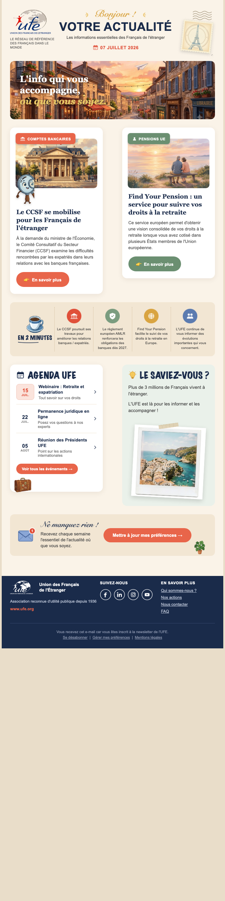

# UFE Monde — Newsletter e-mail

Newsletter HTML responsive et compatible clients de messagerie pour **UFE — Union des Français de l'Étranger**.

## Aperçu

## Caractéristiques

- **Largeur max 600px**, mise en page basée sur des tableaux (compatibilité Outlook)
- **Styles inline** uniquement (les blocs `<style>` sont ignorés par la plupart des clients)
- **Boutons « bulletproof »** avec fallback VML pour Outlook
- **Responsive** : les colonnes s'empilent sur mobile via media query
- **Icônes** en PNG transparents (rasterisés depuis SVG) pour un rendu net partout
- **Polices manuscrites** rasterisées en images pour les titres (les clients e-mail n'embarquent pas les polices)
- Texte alternatif (`alt`) sur toutes les images

## Structure

- `newsletter.html` — le fichier final à envoyer
- `assets/` — images utilisées par l'e-mail (héros, cartes, illustrations)
  - `assets/icons/` — icônes plates (banque, bouclier, globe, réseaux sociaux…)
  - `assets/text/` — titres manuscrits rasterisés
- Fichiers sources originaux (`*.png`, `*.docx`) à la racine

## Charte

| Couleur | Hex |
|---|---|
| Bleu marine | `#1a2b4a` |
| Rouge corail | `#e8654a` |
| Vert sauge | `#6b8f71` |
| Or/ambre | `#d9a441` |
| Fond crème | `#faf3e8` |

## Utilisation

Ouvrir `newsletter.html` dans un navigateur pour prévisualiser, ou l'importer dans votre plateforme d'emailing. Les chemins des images sont relatifs à `assets/` — pensez à héberger ces images et à remplacer les chemins par des URLs absolues avant l'envoi.
